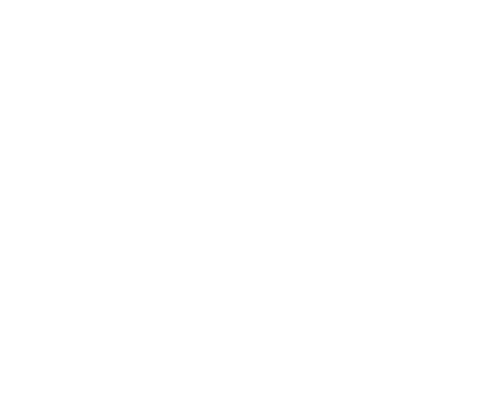

<h1>
Hi there, I am Lesia! 👋
</h1>

   

###

  <h2>💾 About Me</h2>
  <ul style="list-style-type: none; padding: 0;">
    <li>💻 I like studying something new and Computer Science is the perfect place for that</li>
    <li>🎓 Pursuing my Master’s degree in Computer Science to deepen my understanding of advanced topics</li>
    <li>🌱 Currently diving deeper into Python and its frameworks</li>
    <li>🔭 I’m improving my skills in JavaScript and React to build modern, responsive web applications</li>
  </ul>

<h2 style="font-family: 'Roboto', sans-serif;">📈 My Stats</h2>

  <table align="center">
    <tr>
      <td>
        
      </td>
      <td>
        
      </td>
    </tr>
  </table>

<h2 style="font-family: 'Roboto', sans-serif;">💻 Technologies I Have Learned</h2>

<table align="center">
  <tr>
     <td align="center"  width="88">
         
       HTML5
    </td>
    <td align="center" width="88">
        
       CSS3
    </td>
<td align="center" width="88">
         
       JavaScript
    </td>
    <td align="center" width="88">
        
       Python
    </td>
    <td align="center" width="88">
        
       React.js
    </td>
    <td align="center" width="88">
        
       Next.js
    </td>
    <td align="center" width="88">
      
       Node.js
    </td>
        <td align="center" width="88">
       
       SQL
      </td>
  </tr>
    <td align="center" width="88">
        
       Sass
    </td>
    <td align="center" width="88"> 
        
       BEM
    </td>
    <td align="center" width="88">
        
       Redux
    </td>
      <td align="center" width="88">
        
       Postman
    </td>
      </td>
      <td align="center" width="88">
        
       MongoDB
     </td>
     <td align="center" width="88">
        
       Git
    </td>
  <td align="center" width="88">
        
       VSCode
     </td>
  <td align="center" width="88">
        
       Figma
     </td>
</table>

